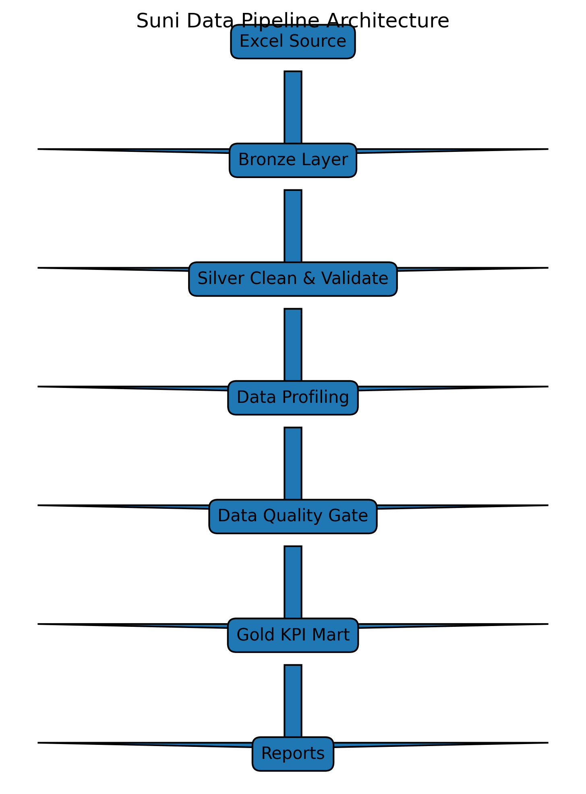

# Suni Data Pipeline

Production-style Data Engineering pipeline built in Python.

---

## Architecture

Excel Source
     ↓
Bronze Layer
     ↓
Silver Clean & Validate
     ↓
Data Profiling
     ↓
Data Quality Gate
     ↓
Gold KPI Mart
     ↓
Reports

---

## Pipeline Layers

Bronze
- Raw Excel ingestion
- Stored as parquet

Silver
- Data cleaning
- Validation
- Schema normalization

Data Quality Gate
- Null rate validation
- Duplicate detection

Gold
- Monthly KPI aggregation
- Repair metrics
- Invoice metrics

Reports
- KPI CSV
- HTML report
- Data quality summary
- Data profiling report

---

## Run Pipeline

make run

---

## Build Delivery Package

make deliver

Outputs

DE_delivery_medior_v2.zip

---

## Stack

- Python
- pandas
- pyarrow
- openpyxl
- Makefile
- GitHub Actions
